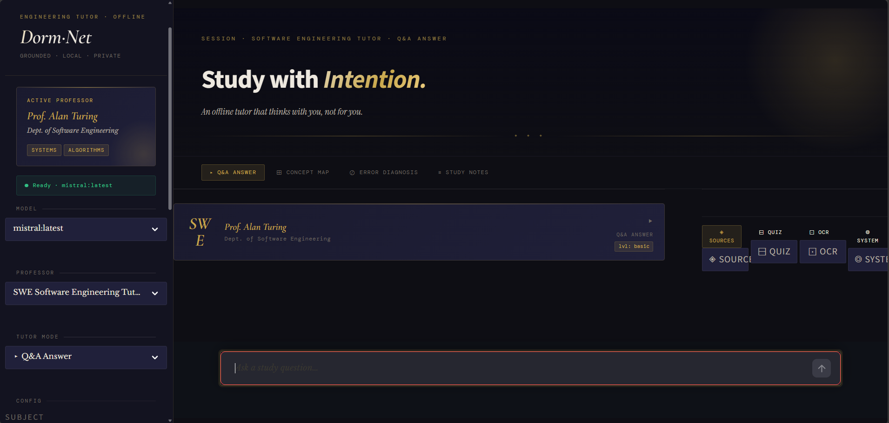
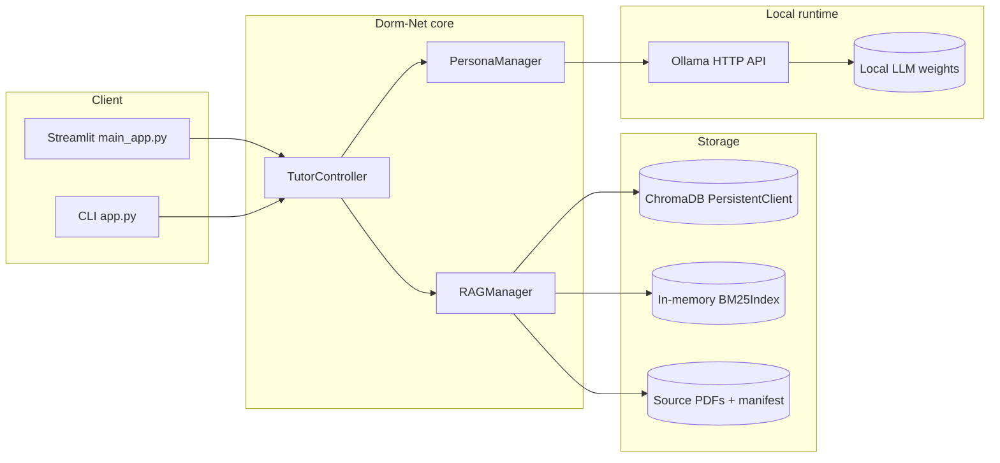
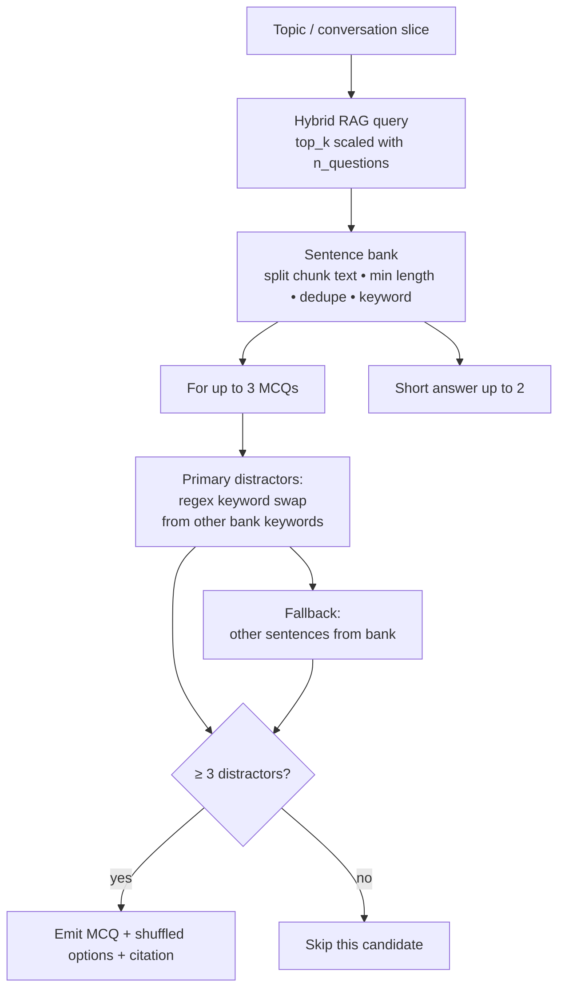

# Dorm-Net

Dorm-Net is an **offline-first** AI tutor for engineering study. It combines **Ollama** for fully local LLM inference, **ChromaDB** with `all-MiniLM-L6-v2` embeddings for semantic retrieval, an in-memory **Okapi BM25** index for lexical grounding, and **Reciprocal Rank Fusion (RRF)** to merge ranked lists without brittle score calibration. **PyMuPDF** ingests PDFs page-by-page; optional **Tesseract** and **OpenCV** support OCR of handwritten notes. After setup, normal tutoring flows run **without external APIs**.

---

## Why Dorm-Net Exists

University dorms are a hostile environment for cloud-first study tools: **spotty Wi‑Fi**, shared networks, late-night cram sessions, and policies that discourage always-on telemetry. Dorm-Net is built for students who need a tutor that **works when the uplink does not**.

A second problem is what we call the **exactitude gap** in standard vector search. Dense embeddings excel at paraphrase and conceptual similarity, but engineering work is often anchored in **symbols, units, identifiers, and short formula fragments** that do not embed like natural language. Pure cosine retrieval can rank a semantically “close” paragraph above the **lexically exact** passage that matches a variable name or standard term. Dorm-Net mitigates this with a **hybrid** pipeline: BM25 supplies sparse, term-level evidence while ChromaDB supplies semantic neighborhood; **RRF** fuses ranks so neither modality silently dominates.

Finally, **local inference via Ollama** keeps prompts, PDF text, and chat history **on machine**: no per-token cloud billing, no third-party retention of your course materials, and a predictable cost model (hardware you already own). For a hackathon demo or a semester of use, that story is easy to defend.

---

## Screenshots & Demo

Place your assets under `screenshots/` (create the folder if needed).




---

## Architecture

### System context (UI → local LLM)

High-level data flow from the Streamlit UI or CLI through retrieval and Ollama.



### Hybrid retrieval: BM25 + ChromaDB → RRF

Retrieval runs **two ranked lists** over the same chunk IDs: cosine similarity in ChromaDB and BM25 scores from an Okapi-style index (`k1`, `b`, length-normalized TF-IDF). **RRF** (`k = 60` in code) combines ranks so a chunk that is strong in only one channel can still surface in the final context window—without assuming comparable score scales between vector distance and BM25.

**BM25 and “saturation” (why it matters for formulas):** Term frequency enters BM25 through a **saturating** transform: repeated occurrences of a token contribute **diminishing returns** compared to raw TF. That dampens keyword stuffing in long pages while still rewarding genuine topical concentration. Together with **inverse document frequency** and **length normalization**, BM25 remains sensitive to **rare technical tokens** (e.g., part numbers, law names, abbreviated theorems) that dense vectors may blur—closing part of the **exactitude gap** described above.

```mermaid
flowchart TB
  Q[User query]

  subgraph Parallel["Parallel retrieval (fetch_k ≥ top_k)"]
    V[ChromaDB query\nembedding = MiniLM-L6-v2\ncosine distance → ranked ids]
    B[BM25 search\nOkapi BM25\ntoken match + IDF + length norm → ranked ids]
  end

  RRF[Reciprocal Rank Fusion\nscore(id) += 1/(k + rank + 1)\nper list; k=60]

  subgraph Post["Post-fusion assembly"]
    MERGE[Merge documents + metadata\nfetch missing ids from Chroma]
    TOP[Truncate to top_k chunks]
  end

  CTX[Ordered context chunks → TutorController → prompt]

  Q --> V
  Q --> B
  V --> RRF
  B --> RRF
  RRF --> MERGE
  MERGE --> TOP
  TOP --> CTX
```

### Quiz generation: distractor quality filtering

Quiz items are **not** LLM-hallucinated stems; they are grounded in **retrieved sentences**. For each multiple-choice item, the engine builds a **sentence bank** from hybrid-retrieved chunks (minimum sentence length, deduplication, keyword extraction). **Distractors** are generated first by **keyword substitution** in the correct sentence—swapping the answer’s dominant technical term for another keyword drawn from the same bank—so wrong options read **locally plausible** yet remain checkable against the text. If fewer than three substitution-based distractors are available, the pipeline **falls back** to other distinct sentences from the bank. Items that still cannot reach **three distractors** are **skipped**, preserving MCQ quality over quantity. Additional **short-answer** prompts are filled from remaining sentences (up to two).



---

## Local model trade-offs (Ollama)

Guidance aligned with this repo’s **performance notes** (single model on ~8 GB RAM, `mistral:latest` as default, `phi3:latest` for responsiveness on lighter hardware, `qwen2.5-coder` for code-heavy behavior). Quantization and OS overhead vary; treat RAM as **planning numbers** for a smooth experience.

| Model | Minimum RAM | Primary use case | Logic depth | Response speed |
|--------|----------------|------------------|-------------|------------------|
| **Mistral 7B** (`mistral:latest`) | ~8 GB | Default **balanced** engineering tutor; general Q&A and multi-step explanations | **Strong** general reasoning | **Moderate** |
| **Phi-3 Mini** (`phi3:latest`) | ~4–6 GB | **Low-memory** laptops; quick iterations and shorter answers | **Lighter**; favors concise chains | **Faster** on constrained hardware |
| **Qwen 2.5 Coder** (`qwen2.5-coder:7b`) | ~8 GB | **Software** focus—debugging, code-shaped prompts, structured outputs | **Deep** on code and symbolic logic | **Moderate** (similar class to Mistral 7B) |

---

## Folder Structure

```text
dorm/
├── app.py
├── main_app.py
├── requirements.txt
├── dorm_net_db/
└── modules/
    ├── brain_module.py
    ├── persona_module.py
    ├── tutor_controller.py
    ├── ui_components.py
    └── vision_module.py
```

---

## Core Features

- Offline Ollama-only tutor engine
- **Hybrid retrieval:** ChromaDB vectors + in-memory BM25, fused with **RRF**
- Selectable personas:
  - Software Engineering Tutor
  - Mechanical Engineering Tutor
  - Electrical Engineering Tutor
  - Math Tutor
  - Explain Like I'm 12
- Adaptive explanation depth
- Step-by-step mode toggle
- Session memory using recent turns
- Grounded answers from uploaded PDFs
- Debug mode with retrieved sources and scores
- **Quiz generation** from retrieved material with **distractor filtering** (keyword-swap first, sentence fallback, skip if insufficient distractors)
- Concept breakdown mode
- Error diagnosis mode
- Lightweight note generation mode

---

## Setup

### 1. Create and activate a virtual environment

Windows:

```powershell
python -m venv venv
.\venv\Scripts\activate
```

Linux/macOS:

```bash
python -m venv venv
source venv/bin/activate
```

### 2. Install Python dependencies

```bash
pip install -r requirements.txt
```

### 3. Install Ollama

Install Ollama from the official installer for your OS, then start it:

```bash
ollama serve
```

### 4. Pull a local model

Recommended for 8GB RAM:

```bash
ollama pull mistral:latest
```

Alternative lighter model:

```bash
ollama pull phi3:latest
```

If you want coding-heavy behavior, you can also use:

```bash
ollama pull qwen2.5-coder:7b
```

### 5. Optional OCR setup

Install Tesseract OCR and, if needed, set:

```powershell
$env:TESSERACT_CMD="C:\Program Files\Tesseract-OCR\tesseract.exe"
```

Or on Linux/macOS:

```bash
export TESSERACT_CMD=/usr/bin/tesseract
```

---

## Run Instructions

### Streamlit UI

```bash
streamlit run main_app.py
```

### CLI

Interactive mode:

```bash
python app.py
```

Single question:

```bash
python app.py --question "Explain Kirchhoff's current law"
```

Index PDFs first:

```bash
python app.py --ingest path/to/book.pdf
```

Use a different persona or mode:

```bash
python app.py --persona electrical --mode concept_breakdown --question "Explain RC charging"
```

---

## Notes on Performance

- Keep one Ollama model loaded at a time on 8GB RAM systems.
- `mistral:latest` is the default.
- Smaller models like `phi3:latest` may feel more responsive on low-memory setups.
- ChromaDB storage is persistent in `dorm_net_db/`.
- PDF ingestion is page-by-page to reduce memory spikes.

---

## Environment Variables

Optional:

- `OLLAMA_URL`
- `DORM_NET_DB_PATH`
- `TESSERACT_CMD`

No cloud API keys are required.
